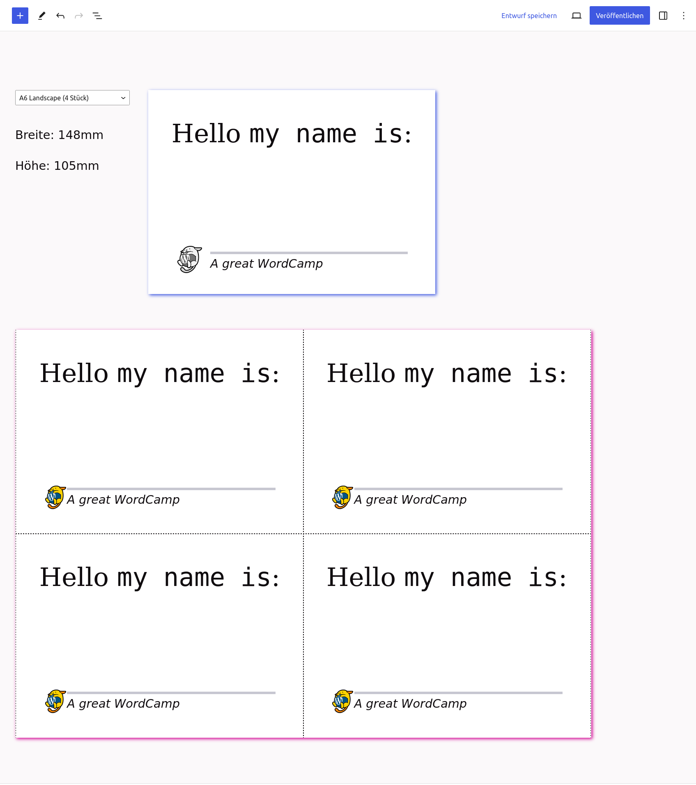

# Label Printing

Stable tag: 0.3.5
Tested up to: 6.5.3
Requires at least: 6.3
Requires PHP: 8.1
License: GPL-3.0+
Tags: Label, print, print.css, block
Contributors: carstenbach


Gutenberg is famous for printing, so let's print multiple identical labels on paper. Using blocks.

## Description

The ***Label Printing* block** plugin is made to help you print multiple identical labels on paper easily. This plugin is ideal for various use cases, such as creating labels for posters, flyers, or any other printed materials. Whether you're managing a theater production or prepare & organize the next local WordCamp, this plugin can help streamline the process for any project that requires physical, printed labels.

### Features

- Create and configure labels with customizable measurements.
- Easily prepare printable labels using the ***Label Printing* block**.
- Use labels like advanced synced patterns.
- Keep label measurements separate from content for efficient label management.
- Follows WordPress coding standards and common best practices.

The plugin allows you to configure a set of labels, probably identical to the paper-labels in your desk. After you prepared at least one label you are ready to print. 

*For now ([#5](https://github.com/figuren-theater/label-printing/issues/5)) this step has no UI, so you have to rely on the default label sizes provided by this plugin or add you own via the `Figuren_Theater\Label_Printing\Patterns\bootstrap_labels` filter.*

A label - within this plugin - consists of a human readable title and the physical measurements of a *normal* printing-label. In other words, width, height and orientation of the label are saved, as well as the borders on an A4 sheet, if any.

### Usage

1. Open a new post or page.
2. Add a ***Label Printing* block** to your content.
    
3. Choose a pre-configured label from the drop-down menu.
    
4. You'll receive a fresh empty template based on the selected label's measurements.
5. Add your content to the template or customize it using blocks.
    
6. Save your post or page.
7. View your well-prepared printing labels on the frontend of your website.
8. Print your labels with ease.
    

### Actions & Filters

The **Label Printing** plugin provides one filter to customize default Labels, that will be created if none exist. Add your own labels or adjust the defaults using this filter.

```php
/**
 * Add your own labels or adjust the defaults using this filter.
 *
 * @hook  Figuren_Theater\Label_Printing\Patterns\bootstrap_labels
 * @since 0.2.0
 *
 * @param {array} $default_labels List of Labels (an array of arrays) that will be inserted into the DB on import by default.
 *
 * @return {array}                List of Labels (an array of arrays) that will be inserted into the DB on import.
 */
\add_filter(
	'Figuren_Theater\Label_Printing\Patterns\bootstrap_labels',
	function( array $default_labels ) : array {
		return [
			[
				'name'         => 'A6 Landscape (4 Labels per A4)',
				'width'        => 148, // in mm
				'height'       => 105, // in mm
				'a4_border_tb' => 0, // in mm
				'a4_border_lr' => 0, // in mm
				'orientation'  => 'landscape',
			],
			[
				'name'         => 'Minis (64 Labels per A4)',
				'width'        => 48, // in mm
				'height'       => 17, // in mm
				'a4_border_tb' => 13, // in mm
				'a4_border_lr' => 8, // in mm
				'orientation'  => 'portrait',
			],
		];
	}
);
```

### Implementation Details 

#### `wp_block` post_type with `_label-printing` post_meta

The data for the physical labels, is saved within the `wp_block` post_type, because it seemed plausible to keep *reusable labels* with *reusable posts*. All measurements like width and height are stored as an array into one post_meta field.

#### `wp_pattern_category` taxonomy with „Label Printing“ (`label-printing`) term

To keep the label `wp_block` posts separated from other posts of the same post_type, all labels are grouped under one term in the (new since 6.4) `wp_pattern_category`. This term is used to query labels when selecting them in the ***Label Printing* block**.

#### Normal `post_or_whatever` post_type

The content to print on each label is saved within that post_type where you added the ***Label Printing* block**. This can be a normal, private, or any other custom post_type. Separating label measurements from content ensures efficient label management and accessibility to all editors.

### Background & Motivation 

>[We are doing theater](https://figuren.theater/), [for a living](https://juliaraab.de/). For more than ten years we do one to three productions each year and try to keep the performances in the schedules of festivals and theaters for multiple years. 
>
>From the very beginning we produced posters and flyers with all relevant data about the show but no dates or venues at all. This behavior allowed us to produce 2.000 posters and 5.000 flyers once before the premiere and often supported by funding and use the materials for years, with the help of labels. 
>
>Using labels helps supporting the nature because it reduces the trash of unused materials, it reduced regular re-prints, delivery and the related emissions. 
>
>*With some automation in place the time to create the labels will be a minimum, I thought.* 
>
>I ended up with more than 15 different label-templates, Adobe Indesign Templates; and me the only one able to manage and handle these templates. And at this point I switched machines, got rid of windows and wanted to even get rid of Indesign. So I would have had to create all the templates now in scribus to get to the same workflow. And after all the possible migration hurdles, I’ll be the only one able to manage the new and fancy scribus templates. No way. So created this block. Now everyone on the team is able to create labels.
>
> [@carstenbach](https://profiles.wordpress.org/carstenbach/)

## Installation

The installation process for the ***Label Printing* block** plugin is straightforward:

### Installation from within WordPress

1. Visit **Plugins** > **Add New**.
2. Search for **Label Printing**.
3. Install and activate the Label Printing plugin.

### Manual installation

1. Upload the entire `label-printing` folder to the `/wp-content/plugins/` directory.
2. Visit **Plugins**.
3. Activate the Label Printing plugin.

### Install via composer

1. Install via command line `composer require figuren-theater/label-printing`
2. Visit **Plugins**.
3. Activate the Label Printing plugin.

## Screenshots

1. Insert the Label Printing block
2. Choose your pre-defined Label
3. Switch visually between different label presets
4. Fill in your label content
5. Check everything in your browsers print dialog, exclude pages with header and footer and finally print your labels.

## Frequently Asked Questions

### What are default label sizes that will be created?

The default labels, if not changed via the `Figuren_Theater\Label_Printing\Patterns\bootstrap_labels` filter, are:

	`
	\$bootstrap_labels = [
		[
			'name'         => 'A6 Landscape',
			'width'        => 148,
			'height'       => 105,
			'a4_border_tb' => 0,
			'a4_border_lr' => 0,
			'orientation'  => 'landscape',
		],
		[
			'name'         => 'A6 Landscape (with Top-Bottom-Borders)',
			'width'        => 148,
			'height'       => 90,
			'a4_border_tb' => 15,
			'a4_border_lr' => 0,
			'orientation'  => 'landscape',
		],
		[
			'name'         => 'A8 Portrait',
			'width'        => 52.5,
			'height'       => 74,
			'a4_border_tb' => 0,
			'a4_border_lr' => 0,
			'orientation'  => 'portrait',
		],
		[
			'name'         => 'A8 Landscape',
			'width'        => 74,
			'height'       => 52.5,
			'a4_border_tb' => 0,
			'a4_border_lr' => 0,
			'orientation'  => 'landscape',
		],
	];
	`

### Why should I use a `blank.php` template

Make sure to only *print* what you really need. If the Print Preview in your browser shows your normal header including logo and navigation, consider selecting only the necessary page in your native print dialog.

Using a `blank.php` template ensures that only the necessary content is printed. If your theme provides this template, it's the best choice to avoid unnecessary headers, post titles, and footers in your printed materials.

### How does the block work?

`figuren-theater/label-printing` is a custom block that uses normal `innerBlocks` to keep the blocks, you are going to add to your label.

To preview the block in the editor and also to render it on the front-end, it uses a hidden, second block called `figuren-theater/label-proxy`. This is a lightweight version of a reusable block, that only works within one post, and not across multiples.

Depending on your selected **pre-defined label** the `…/label-proxy` block will be duplicated as often as the dimensions of the selected label allow. In other words, your label will be fitted into an A4 print-template as often as possible.


## Standards and best-practices, this plugin follows

- ✅ This project is licensed under the **GPL-3.0-or-later**, see the LICENSE file for details
- ✅ WordPress (Coding) Standards 
   1. [PHP Coding Standards](https://developer.wordpress.org/coding-standards/wordpress-coding-standards/php/) (Version 2….)
   2. [JavaScript Coding Standards](https://developer.wordpress.org/coding-standards/wordpress-coding-standards/javascript/)
   3. [CSS Coding Standards](https://developer.wordpress.org/coding-standards/wordpress-coding-standards/css/)
   4. Constantly checked against the [Plugin-review guidelines](https://github.com/figuren-theater/label-printing/pull/47)
- ✅ phpstan on level 8
- ❌ We have no unit-, integration- or e2e-tests in place, consider helping with a PR
- ✅ We [keep a Changelog](https://keepachangelog.com/) in the CHANGELOG.md file.
- ✅ We use git to control all code by version 
- ✅ we use [github.com/figuren-theater/label-printing](https://github.com/figuren-theater/label-printing) for public development 
   - Branch-Protection-Rules help keep the main branch safe
   - PRs are needed to get code into the project
   - dependabot checks all included dependencies for updated versions and looks for vulnerable packages too
- ✅ We try to do semantic versioning
- ✅ Versionnumbers in `plugin.php`, `README.md` and the `CHANGELOG.md` are automatically updated for each release (via GitHub actions)
- ✅ Installable 
   - ~~via wordpress.org/plugins or~~ (NOT YET, see #6 ) 
   - via composer including the [figuren.theater/code-quality](https://github.com/figuren-theater/code-quality/) package
- ✅ We love [WordPress‘ *Decisions, not options* philosophy](https://wordpress.org/about/philosophy/), that’s why there is no settings page at all
- ✅ We only used WordPress‘ core packages to create this plugin, the blocks are scaffolded using the `create-block` package
- ✅ We do not introduce any new, custom UI, instead we only use core-stuff and even incorporate the `wp-admin-color-scheme`.
- ✅ We use a `README.md` as valid [readme.txt for the wp.org/plugins](https://developer.wordpress.org/plugins/wordpress-org/how-your-readme-txt-works/) repository
- ✅ All code is translation-ready and already translated to 
   - de_DE
   - de_DE_formal

## Upgrade Notice

(silence is golden)

## Changelog

Read the changelog partial for [the latest release](https://github.com/figuren-theater/label-printing/releases/latest).

We *keep a Changelog* in the [`CHANGELOG.md`](https://github.com/figuren-theater/label-printing/blob/main/CHANGELOG.md) file.


